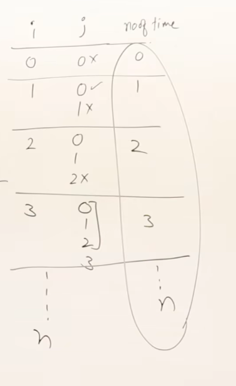
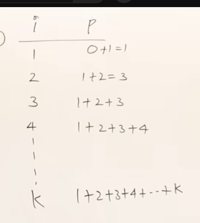

# TIme complexiry Examples

## 1. Example 1:
    for (i=0; i<n; i++)
    {
        for (j=0; j<i; j++)
        {
            stmt
        }
    }

Therefore, the stmt is executed:

$1+2+3+4+5+6......+n$ times

$n(n+1)/2$

**Order**: $O(n^2)$

## 2. Example 2:

    p = 0
    for(i=0; p<n; i++)
    {
        p = p + i
    }

p goes upto 1+2+3+4+5+.....+k times which is essentially $k(k+1)/2$

meaning, it will this loop will execute for $k(k+1)/2 > n$ times

$k^2 > n$

$k > sqrt(n)$

